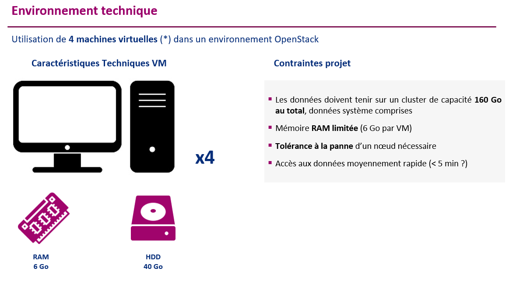
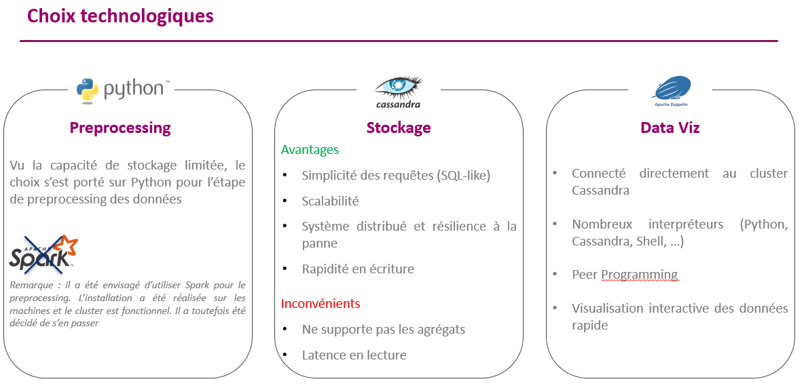
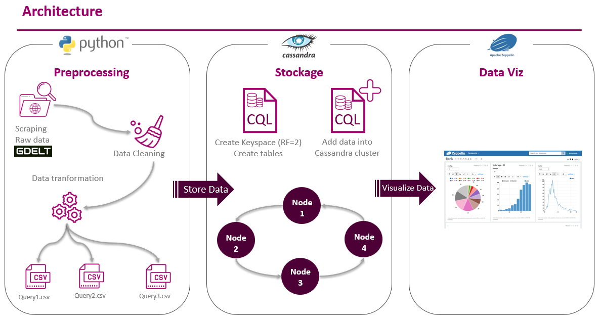
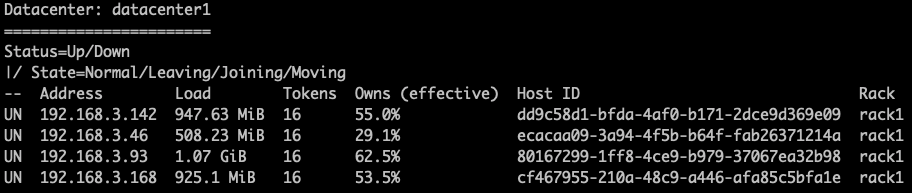

<h2>Table des matières</h2>

<div class="alert alert-block alert-info" style="margin-top: 20px">
<ol>
    <li><a href="#_part1">Introduction</a>
    	<ol>
    		<li><a href="#_part11">Présentation du jeu de données</a></li>
            <li><a href="#_part12">Environnement technique</a></li>
    		<li><a href="#_part13">Choix des technologies</a></li>
            <li><a href="#_part14">Architecture</a></li>
    	</ol>
    </li>
    <li><a href="#_part2">Configuration du cluster</a>
        <ol>
    		<li><a href="#_part21">Installation de Java 8</a></li>
    		<li><a href="#_part22">Installation et configuration de Cassandra</a></li>
            <li><a href="#_part23">Installation et configuration de Zeppelin</a></li>
    	</ol>
    </li>
    <li><a href="#_part6">Preprocessing</a></li>
    <li><a href="#_part7">Preparation des tables CSV</a></li>
    <li><a href="#_part8">Création des Keyspaces et des trables sur Cassandra</a></li>
    <li><a href="#_part9">Requirements</a></li>
</ol>
</div>


[comment]: <> (=================================================================================================================================)

# 1. Introduction <a name="_part1"></a>
[comment]: <> (=================================================================================================================================)

Ce projet a été réalisé dans le cadre du cours de bases de données non relationnelles du MS Big Data de Télécom Paris.
L'objectif est de concevoir un système de stockage distribué résilient aux pannes, et d'exécuter les requêtes suivantes basées sur la [base de données GDELT](https://andreiarion.github.io/Project2022.html) :
- Nombre d’événements pour chaque triplet [jour, pays, langue]
- Evénements d’un pays triés par le nombre de mentions
- Lieux/personnes/thèmes, nombre d’articles et ton moyen pour une source donnée
- Evolution des relations entre deux pays au cours de l’année

## 1.1. Présentation du jeu de données <a name="_part11"></a> 

Le jeu de données est composé de trois tables. 
- La table **EXPORT** contient des informations sur des articles de presse : date de l'événement, informations sur les acteurs mentionnés, informations sur l'événement, etc... 
- La table **MENTIONS** met en relation les articles qui se mentionnent entre eux.
- La table **GKG** permet de connecter chaque élément des articles : personnes, organisations, localisation, thématiques...


## 1.2. Environnement technique <a name="_part12"></a>



## 1.3. Choix des technologies <a name="_part13"></a>



## 1.4. Architecture <a name="_part14"></a>




# 2. Configuration du cluster <a name="_part2"></a>
[comment]: <> (=================================================================================================================================)

Puisque le cluster est de taille restreinte, l'installation et la configuration sont réalisées en ligne de commande directement sur chaque machine.

## 2.1. Installation de Java 8 <a name="_part21"></a> 

Mise à jour des tous les packages existants  
```console
$ sudo apt-get update -y
```

Installation des packages  
```console
$ sudo apt-get install -y openjdk-8-jre-headless
```

## 2.2. Installation et configuration de Cassandra <a name="_part22"></a> 

Téléchargement de la dernière version stable (4.0.1) :

```console
$ wget https://dlcdn.apache.org/cassandra/4.0.1/apache-cassandra-4.0.1-bin.tar.gz
```

Configuration du fichier apache-cassandra-4.0.1/conf/cassandra.yaml

```console
seeds : "<IP_nœeud_1>, <IP_nœeud_2>, ..."  
listen_address : <IP_nœud_courant> 
rpc_address : <IP_nœud_courant>
```

Une fois la configuration terminée, on démarre Cassandra sur chaque machine et on vérifie l'état du cluster :

```console
$ apache-cassandra-4.0.1/bin/cassandra
$ apache-cassandra-4.0.1/bin/nodetool status
```

Le cluster est démarré et les 4 nœeuds sont opérationnels :



## 2.3. Installation et configuration de Zeppelin <a name="_part23"></a> 


# Preprocessing <a name="_part6"></a>

### Scrapping

•	Stockage des URL de téléchargement “.zip” dans deux dataframes : 
    •	Un dataframe pour les URL scrappées masterfilelist.txt
    •	Un dataframe pour les URL scrappées masterfilelist-translation.txt
    
•	Ajout d’une colonne date aux dataframes en parsant la date contenu dans le lien de chaque URL “.zip”

•	Ajout d’une colonne type aux dataframes en parsant le type du fichier contenu dans le lien de chaque URL “.zip” (ex: type_csv {export, mentions, gkg, export_translation, mentions translation, gkg_translation})

•	Sélection des URL en spécifiant une date de début et une date de fin

•	Les dataframe contiennent donc un triplet d’URL avec la date associé à chaque URL au format YYYY:MM-DD:H:M:S (URL export.zip, URL mentions.zip, URL gkg.zip)

**masterfilelist.txt**

```python
def masterfilelist(nb_url, start_date, end_date):
      response = requests.get("http://data.gdeltproject.org/gdeltv2/masterfilelist.txt")
      content = response.content.decode("utf-8") 
      liens = content.split('\n')[-nb_url:]

      liste = list()
      for i in liens:
          liste.append(i.split(" ")[-1])

      df = pd.DataFrame(liste, columns=['url'])
      df['date_str'] = df['url'].apply(lambda x: x.split("/")[-1].split(".")[0][0:12])
      df = df.iloc[:df.shape[0]-1, :]
      df["date"] = pd.to_datetime(df["date_str"], format='%Y%m%d%H%M')

      start_datem = datetime.datetime.strptime(start_date, "%Y-%m-%d %H:%M:%S")
      end_datem = datetime.datetime.strptime(end_date, "%Y-%m-%d %H:%M:%S")
      df = df.loc[(df['date'] >= start_datem) & (df['date'] <= end_datem)]

      df['type_csv'] = df['url'].apply(lambda x: x.lower().split(".csv")[0].split(".")[-1])

      df['id'] = df['date_str']+'_'+df['type_csv']

      df = df.drop(columns=['date'])

      return df
```

**masterfilelist-translation.txt**

```python
def masterfilelist_translation(nb_url, start_date, end_date):

    response = requests.get("http://data.gdeltproject.org/gdeltv2/masterfilelist-translation.txt")
    content = response.content.decode("utf-8") 
    liens = content.split('\n')[-nb_url:]

    liste = list()
    for i in liens:
        liste.append(i.split(" ")[-1])

    df = pd.DataFrame(liste, columns=['url_translation'])
    df['date_str_translation'] = df['url_translation'].apply(lambda x: x.split("/")[-1].split(".")[0][0:12])
    df = df.iloc[:df.shape[0]-1, :]
    df["date"] = pd.to_datetime(df["date_str_translation"], format='%Y%m%d%H%M')

    start_datem = datetime.datetime.strptime(start_date, "%Y-%m-%d %H:%M:%S")
    end_datem = datetime.datetime.strptime(end_date, "%Y-%m-%d %H:%M:%S")
    df = df.loc[(df['date'] >= start_datem) & (df['date'] <= end_datem)]
    
    df['type_csv_translation'] =\
        df['url_translation'].apply(lambda x: '_'.join(x.lower().split(".csv")[0].split(".")[-2:]))

    df['type_csv'] = df['url_translation'].apply(lambda x: x.lower().split(".csv")[0].split(".")[-1])

    df['id'] = df['date_str_translation']+'_'+df['type_csv']

    df = df.drop(columns=['type_csv', 'date'])
    
    return df
```
    
### Vérification de l'url

Vérification de l’URL “.zip” avec la librairie python “validators”

```python
def verify_url(u):
    if validators.url(u):
        return True
    else:
        return False
```

```python
def merge_table(df, df_translation):
    
    # - left join des tableaux
    # - Première séléction : Supprimons les lignes où des NaN apparait
    # - Vérification URL
    
    result = df.merge(df_translation, on='id', how='left').dropna(axis='rows')
    result['work'] = result['url'].apply(lambda x: verify_url(x))
    result['work_translation'] = result['url_translation'].apply(lambda x: verify_url(x))
    return result
```
 
Si une URL “.zip” n’est pas valide alors on supprime le triplet d’URL complet
 
```python
def clean_dataset(df):
    
    dk = df.groupby('date_str').count()[['id']]
    liste = dk[dk.id < 3].index.tolist()
    for item in liste:
        df = df.loc[df['date_str'] != item]

    liste = df.loc[df['work'] == False]['date_str'].unique().tolist()
    for item in liste:
        df = df.loc[df['date_str'] != item]

    liste = df.loc[df['work_translation'] == False]['date_str'].unique().tolist()
    for item in liste:
        df = df.loc[df['date_str'] != item]
            
    return df
```
 
### Fusion des dataframes

Fusion des 2 dataframes d’URL “.zip”

```python
def concat_table(result):
    
    # Séparation des données de base et de translation ET concaténation
    df_base = result[['url', 'type_csv']]
    df_translation = result[['url_translation', 'type_csv_translation']]
    df_translation = df_translation.rename(columns={'url_translation': "url", 'type_csv_translation': "type_csv"})
    final = pd.concat([df_base, df_translation])
    
    return final
```

### Lecture des URL zip

- Lecture des fichiers “.zip” via la librairie python “BytesIO”
- Ouverture des fichiers “.zip” avec la librairie ZipFile. On obtient un fichier “.csv”
- Lecture pour chaque type de csv du fichier en question et transformation en DataFrame
- Concaténation des dataframes du même type

On obtient les 6 DataFrames suivants :

- dataframe export (regroupe tous les fichiers “.csv” de type export qui ont été scrappé pour une date de début et de fin
- dataframe mentions (regroupe tous les fichiers “.csv” de type mentions qui ont été scrappé pour une date de début et de fin
- dataframe gkg (regroupe tous les fichiers “.csv” de type mentions qui ont été scrappé pour une date de début et de fin
- Idem pour les fichiers “.csv” de type translation

```python
def read_zip(final):
    
    export = final.loc[final['type_csv'] == 'export', 'url']
    mentions = final.loc[final['type_csv'] == 'mentions', 'url']
    gkg = final.loc[final['type_csv'] == 'gkg', 'url']
    translation_export = final.loc[final['type_csv'] == 'translation_export', 'url']
    translation_mentions = final.loc[final['type_csv'] == 'translation_mentions', 'url']
    translation_gkg = final.loc[final['type_csv'] == 'translation_gkg', 'url']
    
    df_export = list()
    df_mentions = list()
    df_gkg = list()
    df_translation_export = list()
    df_translation_mentions = list()
    df_translation_gkg = list()
    
    for i in export.tolist():
        url = urlopen(i) 
        k = i.split("/")[-1].split(".zip")[0]
        zipfile = ZipFile(BytesIO(url.read()))
        ffdata = pd.read_csv(zipfile.open(k),
                             header=None,
                             sep="\t",
                             engine='python',
                             encoding='latin-1',
                             on_bad_lines='skip')
        df_export.append(ffdata)
        
    for i in mentions.tolist():
        url = urlopen(i) 
        k = i.split("/")[-1].split(".zip")[0]
        zipfile = ZipFile(BytesIO(url.read()))
        ffdata = pd.read_csv(zipfile.open(k),
                             header=None,
                             sep="\t",
                             engine='python',
                             encoding='latin-1',
                             on_bad_lines='skip')
        df_mentions.append(ffdata)
        
    for i in gkg.tolist():
        url = urlopen(i) 
        k = i.split("/")[-1].split(".zip")[0]
        zipfile = ZipFile(BytesIO(url.read()))
        ffdata = pd.read_csv(zipfile.open(k),
                             header=None,
                             sep="\t",
                             engine='python',
                             encoding='latin-1',
                             on_bad_lines='skip')
        df_gkg.append(ffdata)
        
    for i in translation_export.tolist():
        url = urlopen(i) 
        k = i.split("/")[-1].split(".zip")[0]
        zipfile = ZipFile(BytesIO(url.read()))
        ffdata = pd.read_csv(zipfile.open(k),
                             header=None,
                             sep="\t",
                             engine='python',
                             encoding='latin-1',
                             on_bad_lines='skip')
        df_translation_export.append(ffdata)
        
    for i in translation_mentions.tolist():
        url = urlopen(i) 
        k = i.split("/")[-1].split(".zip")[0]
        zipfile = ZipFile(BytesIO(url.read()))
        ffdata = pd.read_csv(zipfile.open(k),
                             header=None,
                             sep="\t",
                             engine='python',
                             encoding='latin-1',
                             on_bad_lines='skip')
        df_translation_mentions.append(ffdata)
        
    for i in translation_gkg.tolist():
        url = urlopen(i) 
        k = i.split("/")[-1].split(".zip")[0]
        zipfile = ZipFile(BytesIO(url.read()))
        ffdata = pd.read_csv(zipfile.open(k),
                             header=None,
                             sep="\t",
                             engine='python',
                             encoding='latin-1',
                             on_bad_lines='skip')
        df_translation_gkg.append(ffdata)
        
    export = pd.concat(df_export)
    mentions = pd.concat(df_mentions)
    gkg = pd.concat(df_gkg)

    export_translation = pd.concat(df_translation_export)
    mentions_translation = pd.concat(df_translation_mentions)
    gkg_translation = pd.concat(df_translation_gkg)
        
    return export, mentions, gkg, export_translation, mentions_translation, gkg_translation
```

### Preprocessing des dataframes

**Renommage des colonnes**

```python
def rename_columns(export, mentions, gkg, translation_export, translation_mentions, translation_gkg):
    
    for i in range(export.shape[1]):
        export.rename({i: 'export_'+str(i)}, axis=1, inplace=True)
        
    for i in range(mentions.shape[1]):
        mentions.rename({i: 'mentions_'+str(i)}, axis=1, inplace=True)    
        
    for i in range(gkg.shape[1]):
        gkg.rename({i: 'gkg_'+str(i)}, axis=1, inplace=True)
        
    for i in range(translation_export.shape[1]):
        translation_export.rename({i: 'export_translation_'+str(i)}, axis=1, inplace=True)
        
    for i in range(translation_mentions.shape[1]):
        translation_mentions.rename({i: 'mentions_translation_'+str(i)}, axis=1, inplace=True)    
        
    for i in range(translation_gkg.shape[1]):
        translation_gkg.rename({i: 'gkg_translation_'+str(i)}, axis=1, inplace=True)            
    
    return export, mentions, gkg, translation_export, translation_mentions, translation_gkg
```

**Data to Datetime**

Transformation des dates en type datetime

```python
def date_to_datime(export, mentions, gkg, export_translation, mentions_translation, gkg_translation):
    export["export_1"] = pd.to_datetime(export["export_1"],
                                        format='%Y%m%d')
    mentions["mentions_1"] = pd.to_datetime(mentions["mentions_1"],
                                            format='%Y%m%d%H%M%S')
    gkg["gkg_1"] = pd.to_datetime(gkg["gkg_1"],
                                  format='%Y%m%d%H%M%S')

    export_translation["export_translation_1"] = pd.to_datetime(export_translation["export_translation_1"],
                                                                format='%Y%m%d')
    mentions_translation["mentions_translation_1"] = pd.to_datetime(mentions_translation["mentions_translation_1"],
                                                                    format='%Y%m%d%H%M%S')
    gkg_translation["gkg_translation_1"] = pd.to_datetime(gkg_translation["gkg_translation_1"],
                                                          format='%Y%m%d%H%M%S')
    
    return export, mentions, gkg, export_translation, mentions_translation, gkg_translation
```

# Préparation des tables CSV pour les 4 requêtes à effectuer<a name="_part7"></a>

### REQUETE 1

_Afficher le nombre d’articles par évènement qu’il y a eu pour chaque triplet (jour, pays de l’évènement, langue de l’article)_

**Jointure entre des tables mentions_translation et mentions et export**

```python
def merge_table_bis(export, mentions, mentions_translation):
    sub_mentions_translation =\
        mentions_translation.loc[:, ["mentions_translation_0", "mentions_translation_14"]]
    sub_mentions_translation["mentions_translation_14"] =\
        sub_mentions_translation["mentions_translation_14"].apply(lambda x: x.split(";")[0].split(":")[1])
    mentions_mentions_translation =\
        mentions.merge(sub_mentions_translation, left_on='mentions_0', right_on='mentions_translation_0', how='left')
    export_mentions_mentions_translation_joined =\
        mentions_mentions_translation.merge(export, left_on="mentions_0", right_on="export_0", how='left')
    return export_mentions_mentions_translation_joined
```

**Construction de la table CSV pour la requete 1**
```python
def requete_1(export_mentions_mentions_translation_joined):
    requete1 = export_mentions_mentions_translation_joined.loc[:, ["mentions_0", 
                                                                   "mentions_1", 
                                                                   "export_53", 
                                                                   "export_5",  
                                                                   "export_15", 
                                                                   "export_34", 
                                                                   "mentions_translation_14"]]
    requete1['date'] = requete1["mentions_1"].dt.date
    requete1['day'] = requete1["mentions_1"].dt.day
    requete1['month'] = requete1["mentions_1"].dt.month
    requete1['year'] = requete1["mentions_1"].dt.year
    

    requete1.rename(columns={"mentions_0" : "id_event",
                            "mentions_1" : "datetime",
                            "export_53" : "country_code",
                            "export_5" : "actor1_code",
                            "export_15" : "actor2_code",
                            "export_34" : "avg_tone",
                            "mentions_translation_14" : "source_langue"}, inplace=True)
    
    # Drop all rows with full NaN values
    col = requete1.columns.tolist()
    requete1 = requete1.dropna(subset=col, how='all')
    
    # We select all rows with non-NaN values for column "country_code"
    requete1 = requete1[requete1['country_code'].notna()]

    # requete1.to_csv('out/requete1.csv', index=False)
    requete1.to_csv(r'/home/ubuntu/csv/requete1/requete1.csv', index=False)
    
    return requete1
```


### REQUETE 2

_Pour un pays donné en paramètre, affichez les événements triés par le nombre de mentions (tri décroissant) et permettez une agrégation par jour/mois/année_

**Construction de la table CSV pour la requete 2**

```python
def requete_2(export):

    requete2 = export.loc[:, ["export_0", "export_1", "export_53", "export_31"]]
    
    requete2['date'] = requete2["export_1"].dt.date
    requete2['day'] = requete2["export_1"].dt.day
    requete2['month'] = requete2["export_1"].dt.month
    requete2['year'] = requete2["export_1"].dt.year

    requete2.rename(columns={"export_0": "id_event",
                             "export_1": "datetime",
                             "export_53": "country_code",
                             "export_31": "nb_mentions"}
                             ,inplace=True)
    
    # Drop all rows with full NaN values
    col = requete2.columns.tolist()
    requete2 = requete2.dropna(subset=col, how='all')

    # requete2.to_csv('out/requete2.csv', index=False)
    requete2.to_csv(r'/home/ubuntu/csv/requete2/requete2.csv', index=False)
    
    return requete2
```


### REQUETE 3

_Pour une source de donnés passée en paramètre, affichez les thèmes, personnes, lieux dont les articles de cette sources parlent ainsi que le nombre d’articles et le ton moyen des articles (pour chaque thème/personne/lieu); permettez une agrégation par jour/mois/année_

**Construction de la table CSV pour la requete 3**

```python
def requete_3(gkg):
    requete3 = gkg.loc[:, ["gkg_0", "gkg_1", "gkg_3", "gkg_7", "gkg_11", "gkg_9", "gkg_15"]]
    
    requete3['date'] = requete3["gkg_1"].dt.date
    requete3['day'] = requete3["gkg_1"].dt.day
    requete3['month'] = requete3["gkg_1"].dt.month
    requete3['year'] = requete3["gkg_1"].dt.year

    requete3.rename(columns={"gkg_0": "id_gkg",
                             "gkg_1": "datetime",
                             "gkg_3": "source_domain",
                             "gkg_7": "themes",
                             "gkg_11": "persons",
                             "gkg_9": "locations",
                             "gkg_15": "avg_tone"}, inplace=True)

    requete3["locations"].fillna('NO_INFO', inplace=True)
    requete3["locations"] = requete3["locations"].apply(lambda x: str(x).split(",")[0].split("#")[-1])
    requete3["avg_tone"].fillna('0.0', inplace=True)
    requete3["avg_tone"] = requete3["avg_tone"].apply(lambda x: float(str(x).split(",")[0]))
    
    # Drop url as id_gkg
    requete3 = requete3[requete3["id_gkg"].apply(lambda x: x[0].isnumeric())]        
    
    # Drop all rows with full NaN values
    col = requete3.columns.tolist()
    requete3 = requete3.dropna(subset=col, how='all')

    # requete3.to_csv('out/requete3.csv', index=False)
    requete3.to_csv(r'/home/ubuntu/csv/requete3/requete3.csv', index=False)

    return requete3
```


### REQUETE 4

_Evolution des relations entre deux pays au cours de l’année_

**Construction de la table CSV pour la requete 4**


# Création du keyspace et des tables Cassandra<a name="_part8"></a>


# Requirements <a name="_part9"></a>

```python
import validators
import requests
import pandas as pd
import numpy as np
from io import BytesIO
from zipfile import ZipFile
from urllib.request import urlopen
import datetime
import time
import sys
