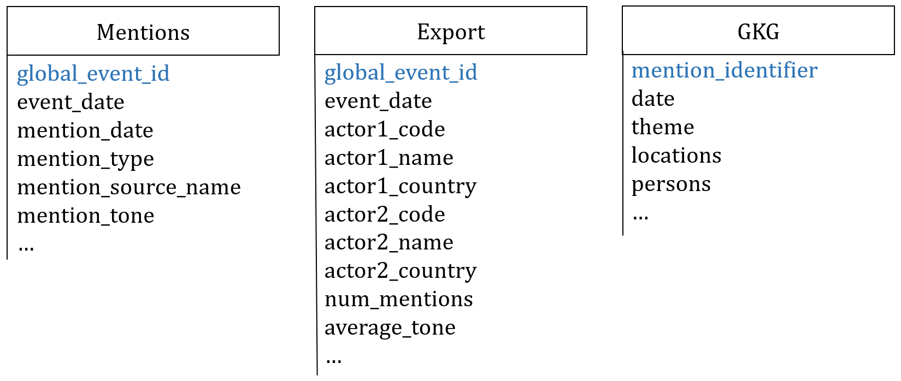
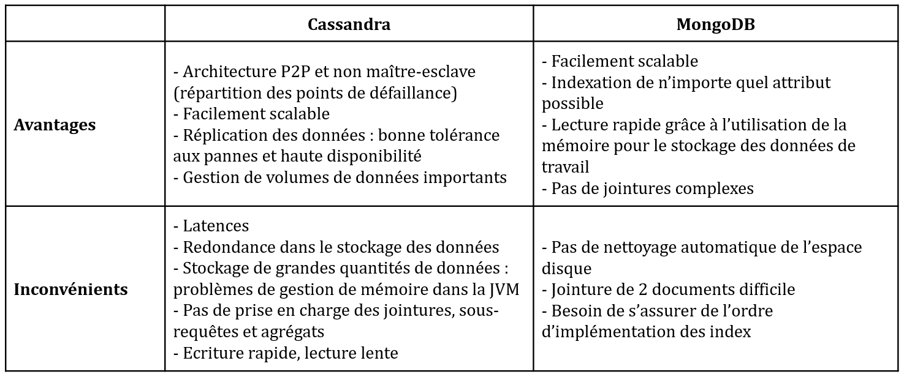

# Projet GDELT

[comment]: <> (TABLE OF CONTENTS ===============================================================================================================)
##### [Introduction](#_introduction)
##### [Présentation du jeu de données](#_part1)
##### [Choix des technologies](#_part2)
##### [Configuration du cluster](#_part3)

[comment]: <> (=================================================================================================================================)

# Introduction 

Ce projet a été réalisé dans le cadre du cours de bases de données non relationnelles du MS Big Data de Télécom Paris. L'objectif est proposer un système de stockage distribué, résilient et performant pour repondre aux question suivantes :
- afficher le nombre d’articles/évènements qu’il y a eu pour chaque triplet (jour, pays de l’évènement, langue de l’article).

- pour un pays donné en paramètre, affichez les évènements qui y ont eu place triées par le nombre de mentions (tri décroissant); permettez une agrégation par jour/mois/année

- pour une source de donnés passée en paramètre (gkg.SourceCommonName) affichez les thèmes, personnes, lieux dont les articles de cette sources parlent ainsi que le nombre d’articles et le ton moyen des articles (pour chaque thème/personne/lieu); permettez une agrégation par jour/mois/année.

- étudiez l’évolution des relations entre deux pays (specifies en paramètre) au cours de l’année. Vous pouvez vous baser sur la langue de l’article, le ton moyen des articles, les themes plus souvent citées, les personalités ou tout element qui vous semble pertinent.

# Présentation du jeu de données  
[comment]: <> (=================================================================================================================================)
Le jeu de données est composé de trois tables. 
- La table Export contient des informations sur des articles de presse : date de l'évènement, informations sur les acteurs mentionnés, informations sur l'évènement... 
- La table Mentions met en relation les articles mentionnés dans d'autres.
- La table GKG permet de connecter chaque élément ensemble : personnes, organisations, localisation, thème... pour rendre compte de ce qui se passe dans le monde.
- it connects every person, organization, location, count, theme,

Configuration du cluster

# Choix des technologies 
[comment]: <> (=================================================================================================================================)

La technologie que nous avons retenu est Cassandra. Bien que la scalabilité ne soit pas nécessairement recherchée puisque l'on travaille sur 5 machines, l'avantage va à Cassandra pour ses multiples noeuds maîtres. Cassandra est tolérant vis-à-vis des pannes et offre une bonne disponibilité des données (architecture P2P et réplication des données). Cassandra est relativement rapide en écriture. Par ailleurs, contrairement à la tolérance aux pannes, la vitesse de lecture n’est pas une contrainte pour le projet.
Enfin, les VM de l’école disposent d’une RAM limitée, rendant MongoDB peu opérant dans l’utilisation de la mémoire pour le stockage des données de travail.
L’avantage va donc à Cassandra.

Pour réaliser ce projet, telles sont les contraintes qui nous sont imposées :
-	Peu d’espace disque disponible (maximum 200 Go en tout, données système comprises)
-	Peu de RAM sur les VM
-	Tolérance à la panne d’un nœud nécessaire
-	Accès aux données moyennement rapide (<5min ?)

# Configuration du cluster 
[comment]: <> (=================================================================================================================================)

### Installation de Java 8

### 

